# InterviewOS — Multi-Agent System Architecture
**Version:** 1.0.0  
**Status:** Active  
**Last Updated:** 2026-06-16  
**Author:** Platform Engineering Team  
**Classification:** Internal — Technical Reference  

---

## Table of Contents

1. [System Overview](#1-system-overview)
2. [LangGraph StateGraph Design](#2-langgraph-stategraph-design)
3. [Agent 1: Resume Analyzer](#3-agent-1-resume-analyzer)
4. [Agent 2: JD Analyzer](#4-agent-2-jd-analyzer)
5. [Agent 3: Question Generator](#5-agent-3-question-generator)
6. [Agent 4: Interview Conductor](#6-agent-4-interview-conductor)
7. [Agent 5: Communication Evaluator](#7-agent-5-communication-evaluator)
8. [Agent 6: Technical Evaluator](#8-agent-6-technical-evaluator)
9. [Agent 7: Behavioral Evaluator](#9-agent-7-behavioral-evaluator)
10. [Agent 8: Learning Coach](#10-agent-8-learning-coach)
11. [Agent 9: Progress Tracker](#11-agent-9-progress-tracker)
12. [Inter-Agent Communication Protocols](#12-inter-agent-communication-protocols)
13. [State Management](#13-state-management)
14. [Error Handling & Fallback Mechanisms](#14-error-handling--fallback-mechanisms)
15. [Observability](#15-observability)
16. [Security Architecture](#16-security-architecture)
17. [Deployment Architecture](#17-deployment-architecture)

---

## 1. System Overview

### 1.1 Architecture Philosophy

InterviewOS is built on the principle of **Specialized Agent Orchestration** — rather than relying on a single monolithic AI model to handle all tasks, it deploys nine domain-specialized agents, each optimized for a specific phase of the interview lifecycle. This architecture enables:

- **Higher quality outputs** through agent specialization
- **Parallelizable processing** (Resume + JD analysis can run concurrently)
- **Granular observability** (each agent's decisions are independently traceable)
- **Modularity** (individual agents can be upgraded without full system redeployment)
- **Fault tolerance** (agent failures don't cascade through the entire pipeline)

### 1.2 High-Level Architecture

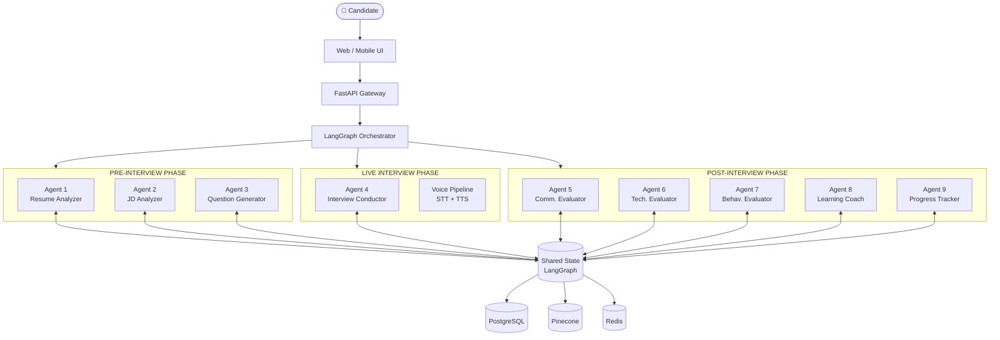

### 1.3 Technology Stack

| Layer | Technology | Version | Purpose |
|---|---|---|---|
| **Orchestration** | LangGraph | 0.2.x | Agent state machine orchestration |
| **LLM (Primary)** | Google Gemini 2.0 Flash | Latest | Main reasoning engine |
| **LLM (Secondary)** | OpenAI GPT-4o | Latest | Fallback + specialized tasks |
| **Embeddings** | text-embedding-3-large | v3 | Semantic search, skill matching |
| **STT** | Deepgram Nova-2 | Latest | Speech-to-text for voice interviews |
| **TTS** | ElevenLabs | v2 | Text-to-speech for AI interviewer |
| **API Framework** | FastAPI | 0.110+ | REST API gateway |
| **Vector Database** | Pinecone | Serverless | Question bank, RAG retrieval |
| **Primary Database** | PostgreSQL 16 | 16.x | Users, sessions, reports |
| **Cache** | Redis 7 | 7.2 | Session state, rate limiting |
| **Message Queue** | Google Pub/Sub | Latest | Async agent messaging |
| **Agent Framework** | LangChain | 0.2.x | LLM tooling, chains |
| **Container** | Docker + Kubernetes | 1.29 | Containerized deployment |
| **Cloud** | Google Cloud Platform | N/A | Primary cloud provider |
| **Monitoring** | Datadog | N/A | APM + infrastructure metrics |

### 1.4 Agent Interaction Timeline

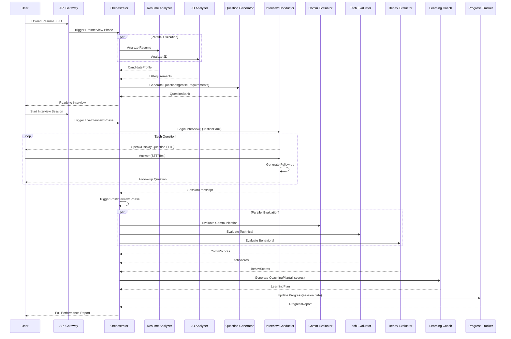

---

## 2. LangGraph StateGraph Design

### 2.1 State Schema

```python
from typing import TypedDict, Optional, List, Dict, Any, Literal
from dataclasses import dataclass, field
from datetime import datetime
from enum import Enum

class InterviewType(str, Enum):
    SOFTWARE_ENGINEERING = "software_engineering"
    NON_TECHNICAL = "non_technical"
    GOVERNMENT_EXAM = "government_exam"
    HIGHER_EDUCATION = "higher_education"

class InterviewSubType(str, Enum):
    # SE subtypes
    DSA = "dsa"
    SYSTEM_DESIGN = "system_design"
    BACKEND = "backend"
    FRONTEND = "frontend"
    DEVOPS = "devops"
    AI_ML = "ai_ml"
    # Non-tech subtypes
    PRODUCT_MANAGER = "product_manager"
    MARKETING = "marketing"
    FINANCE = "finance"
    OPERATIONS = "operations"
    # Gov subtypes
    UPSC = "upsc"
    SSC = "ssc"
    BANKING = "banking"
    DEFENCE = "defence"
    # Higher Ed subtypes
    MS_INTERVIEW = "ms_interview"
    MBA_INTERVIEW = "mba_interview"
    GRE = "gre"
    IELTS = "ielts"

class SessionPhase(str, Enum):
    PRE_INTERVIEW = "pre_interview"
    LIVE_INTERVIEW = "live_interview"
    POST_INTERVIEW = "post_interview"
    COMPLETED = "completed"

@dataclass
class SkillEntry:
    name: str
    category: str  # e.g., "programming_language", "framework", "soft_skill"
    confidence: float  # 0.0 - 1.0
    years_experience: Optional[float] = None
    proficiency_level: Optional[str] = None  # beginner/intermediate/advanced/expert
    source: str = "resume"  # resume | jd | inferred

@dataclass
class WorkExperience:
    company: str
    title: str
    start_date: Optional[str] = None
    end_date: Optional[str] = None
    is_current: bool = False
    description: str = ""
    quantified_achievements: List[str] = field(default_factory=list)
    technologies_used: List[str] = field(default_factory=list)
    inferred_impact_level: str = "medium"  # low | medium | high | exceptional

@dataclass
class CandidateProfile:
    # Basic info
    name: Optional[str] = None
    email: Optional[str] = None
    
    # Professional
    total_years_experience: float = 0.0
    current_title: Optional[str] = None
    current_company: Optional[str] = None
    seniority_level: str = "junior"  # intern | junior | mid | senior | staff | principal | manager | director
    
    # Skills
    technical_skills: List[SkillEntry] = field(default_factory=list)
    soft_skills: List[SkillEntry] = field(default_factory=list)
    certifications: List[str] = field(default_factory=list)
    
    # Education
    education: List[Dict[str, Any]] = field(default_factory=list)
    
    # Experience
    work_history: List[WorkExperience] = field(default_factory=list)
    
    # Analysis
    ats_score: float = 0.0
    career_progression: str = "linear"  # linear | lateral | upward | downward | varied
    skill_gaps: List[str] = field(default_factory=list)
    
    # Confidence
    extraction_confidence: float = 0.0

@dataclass
class JDRequirements:
    role_title: str = ""
    company: str = ""
    seniority_level: str = "mid"
    
    # Requirements
    required_skills: List[str] = field(default_factory=list)
    preferred_skills: List[str] = field(default_factory=list)
    required_years_experience: Optional[int] = None
    required_education: Optional[str] = None
    
    # Culture
    culture_signals: List[str] = field(default_factory=list)
    work_style: str = "collaborative"  # independent | collaborative | fast-paced | structured
    
    # Interview hints
    likely_interview_focus: List[str] = field(default_factory=list)
    
    # Market data
    estimated_salary_range: Optional[Dict[str, int]] = None
    market_demand_level: str = "medium"  # low | medium | high | very_high

@dataclass
class Question:
    question_id: str
    text: str
    type: str  # technical | behavioral | situational | system_design | coding
    subtype: Optional[str] = None  # dsa | api_design | leadership | conflict | etc.
    difficulty: int = 5  # 1-10
    topic: str = ""
    estimated_duration_minutes: int = 5
    follow_up_trees: List[List[str]] = field(default_factory=list)  # nested follow-up questions
    rubric: Optional[Dict[str, Any]] = None
    expected_answer_elements: List[str] = field(default_factory=list)
    tags: List[str] = field(default_factory=list)

@dataclass
class QuestionResponse:
    question_id: str
    question_text: str
    response_text: str
    response_audio_url: Optional[str] = None
    response_duration_seconds: float = 0.0
    follow_ups_asked: List[str] = field(default_factory=list)
    timestamp: str = ""
    
@dataclass
class DimensionScore:
    dimension_name: str
    score: float  # 0.0 - 10.0
    max_score: float = 10.0
    weight: float = 1.0
    justification: str = ""
    specific_feedback: List[str] = field(default_factory=list)
    improvement_suggestions: List[str] = field(default_factory=list)

@dataclass
class PerformanceReport:
    session_id: str
    overall_score: float = 0.0
    readiness_level: str = "building"  # not_ready | building | ready | outstanding
    
    # Dimension scores
    technical_scores: List[DimensionScore] = field(default_factory=list)
    communication_scores: List[DimensionScore] = field(default_factory=list)
    behavioral_scores: List[DimensionScore] = field(default_factory=list)
    
    # Aggregates
    technical_composite: float = 0.0
    communication_composite: float = 0.0
    behavioral_composite: float = 0.0
    
    # Insights
    top_strengths: List[str] = field(default_factory=list)
    top_improvement_areas: List[str] = field(default_factory=list)
    peer_percentile: Optional[float] = None
    
    # Per-question analysis
    question_analyses: List[Dict[str, Any]] = field(default_factory=list)

class InterviewOSState(TypedDict):
    """
    Master state object for the InterviewOS LangGraph StateGraph.
    This state is passed between all agents and represents the
    complete context of an interview session.
    """
    
    # Session metadata
    session_id: str
    user_id: str
    phase: SessionPhase
    interview_type: InterviewType
    interview_subtype: Optional[InterviewSubType]
    created_at: str
    updated_at: str
    
    # Input data
    raw_resume_text: Optional[str]
    raw_jd_text: Optional[str]
    candidate_name: Optional[str]
    target_role: Optional[str]
    target_company: Optional[str]
    years_experience_self_reported: Optional[float]
    session_duration_minutes: int  # target duration
    difficulty_preference: str  # easy | medium | hard | adaptive
    
    # Agent 1 outputs
    candidate_profile: Optional[CandidateProfile]
    resume_analysis_complete: bool
    resume_analysis_confidence: float
    
    # Agent 2 outputs
    jd_requirements: Optional[JDRequirements]
    jd_analysis_complete: bool
    
    # Agent 3 outputs
    question_bank: List[Question]
    current_question_index: int
    total_questions: int
    question_generation_complete: bool
    
    # Agent 4 (live interview) state
    session_transcript: List[QuestionResponse]
    current_question: Optional[Question]
    interview_started_at: Optional[str]
    interview_ended_at: Optional[str]
    voice_mode_enabled: bool
    current_follow_up_depth: int
    interviewer_persona: str  # formal | casual | challenging | panel
    emotional_indicators: Dict[str, Any]
    
    # Agent 5 outputs
    communication_scores: List[DimensionScore]
    communication_analysis_complete: bool
    filler_word_count: int
    star_compliance_rate: float
    
    # Agent 6 outputs
    technical_scores: List[DimensionScore]
    technical_analysis_complete: bool
    code_quality_metrics: Dict[str, Any]
    
    # Agent 7 outputs
    behavioral_scores: List[DimensionScore]
    behavioral_analysis_complete: bool
    competency_scores: Dict[str, float]
    
    # Agent 8 outputs
    learning_plan: Optional[Dict[str, Any]]
    weakness_diagnosis: List[str]
    coaching_plan_generated: bool
    
    # Agent 9 outputs
    progress_data: Optional[Dict[str, Any]]
    skill_velocity: Dict[str, float]
    peer_percentile: Optional[float]
    
    # Final report
    performance_report: Optional[PerformanceReport]
    report_generation_complete: bool
    
    # Error handling
    agent_errors: Dict[str, str]
    retry_counts: Dict[str, int]
    fallback_activated: Dict[str, bool]
```

### 2.2 StateGraph Node Definitions

```python
from langgraph.graph import StateGraph, END
from langgraph.checkpoint.sqlite import SqliteSaver

def build_interview_graph() -> StateGraph:
    """
    Builds the complete InterviewOS LangGraph StateGraph.
    """
    graph = StateGraph(InterviewOSState)
    
    # Pre-interview phase nodes
    graph.add_node("resume_analyzer", resume_analyzer_node)
    graph.add_node("jd_analyzer", jd_analyzer_node)
    graph.add_node("merge_pre_analysis", merge_pre_analysis_node)
    graph.add_node("question_generator", question_generator_node)
    
    # Live interview phase nodes
    graph.add_node("interview_conductor", interview_conductor_node)
    graph.add_node("question_loop", question_loop_node)
    graph.add_node("follow_up_handler", follow_up_handler_node)
    
    # Post-interview phase nodes
    graph.add_node("communication_evaluator", communication_evaluator_node)
    graph.add_node("technical_evaluator", technical_evaluator_node)
    graph.add_node("behavioral_evaluator", behavioral_evaluator_node)
    graph.add_node("evaluation_aggregator", evaluation_aggregator_node)
    graph.add_node("learning_coach", learning_coach_node)
    graph.add_node("progress_tracker", progress_tracker_node)
    graph.add_node("report_generator", report_generator_node)
    
    # Entry point
    graph.set_entry_point("resume_analyzer")
    
    # Pre-interview edges (parallel execution)
    graph.add_edge("resume_analyzer", "merge_pre_analysis")
    graph.add_edge("jd_analyzer", "merge_pre_analysis")
    graph.add_edge("merge_pre_analysis", "question_generator")
    graph.add_edge("question_generator", "interview_conductor")
    
    # Live interview loop edges
    graph.add_conditional_edges(
        "question_loop",
        should_continue_interview,
        {
            "next_question": "interview_conductor",
            "follow_up": "follow_up_handler",
            "end_interview": "communication_evaluator"
        }
    )
    graph.add_edge("follow_up_handler", "question_loop")
    
    # Post-interview parallel evaluation
    graph.add_edge("communication_evaluator", "evaluation_aggregator")
    graph.add_edge("technical_evaluator", "evaluation_aggregator")
    graph.add_edge("behavioral_evaluator", "evaluation_aggregator")
    
    # Sequential post-evaluation
    graph.add_edge("evaluation_aggregator", "learning_coach")
    graph.add_edge("learning_coach", "progress_tracker")
    graph.add_edge("progress_tracker", "report_generator")
    graph.add_edge("report_generator", END)
    
    # Add checkpointing
    memory = SqliteSaver.from_conn_string(":memory:")
    return graph.compile(checkpointer=memory)


def should_continue_interview(state: InterviewOSState) -> str:
    """
    Conditional edge function to determine interview flow.
    """
    current_idx = state["current_question_index"]
    total = state["total_questions"]
    depth = state["current_follow_up_depth"]
    
    # Check if session time exceeded
    if _session_time_exceeded(state):
        return "end_interview"
    
    # If candidate's answer suggests a follow-up opportunity
    if depth < 2 and _should_ask_follow_up(state):
        return "follow_up"
    
    # If more questions remain
    if current_idx < total - 1:
        return "next_question"
    
    return "end_interview"
```

### 2.3 Parallel Execution Pattern

```python
import asyncio
from typing import Coroutine

async def run_pre_interview_parallel(state: InterviewOSState) -> InterviewOSState:
    """
    Runs Resume Analyzer and JD Analyzer in parallel to minimize latency.
    Reduces pre-interview processing from ~15s sequential to ~8s parallel.
    """
    resume_task = asyncio.create_task(
        resume_analyzer_async(state["raw_resume_text"])
    )
    jd_task = asyncio.create_task(
        jd_analyzer_async(state["raw_jd_text"])
    )
    
    candidate_profile, jd_requirements = await asyncio.gather(
        resume_task, jd_task, return_exceptions=True
    )
    
    # Handle partial failures gracefully
    if isinstance(candidate_profile, Exception):
        state["agent_errors"]["resume_analyzer"] = str(candidate_profile)
        candidate_profile = _build_minimal_profile(state)
    
    if isinstance(jd_requirements, Exception):
        state["agent_errors"]["jd_analyzer"] = str(jd_requirements)
        jd_requirements = _build_minimal_jd_requirements(state)
    
    state["candidate_profile"] = candidate_profile
    state["jd_requirements"] = jd_requirements
    return state


async def run_post_interview_parallel(state: InterviewOSState) -> InterviewOSState:
    """
    Runs Communication, Technical, and Behavioral evaluators in parallel.
    """
    comm_task = asyncio.create_task(
        communication_evaluator_async(state["session_transcript"])
    )
    tech_task = asyncio.create_task(
        technical_evaluator_async(state["session_transcript"], state["question_bank"])
    )
    behav_task = asyncio.create_task(
        behavioral_evaluator_async(state["session_transcript"])
    )
    
    comm_scores, tech_scores, behav_scores = await asyncio.gather(
        comm_task, tech_task, behav_task, return_exceptions=True
    )
    
    state["communication_scores"] = comm_scores if not isinstance(comm_scores, Exception) else []
    state["technical_scores"] = tech_scores if not isinstance(tech_scores, Exception) else []
    state["behavioral_scores"] = behav_scores if not isinstance(behav_scores, Exception) else []
    return state
```

---

## 3. Agent 1: Resume Analyzer

### 3.1 Agent Overview

The Resume Analyzer is the **first agent in the pipeline**, responsible for transforming unstructured resume text into a rich, structured candidate profile that serves as the personalization foundation for all downstream agents.

### 3.2 Decision Tree

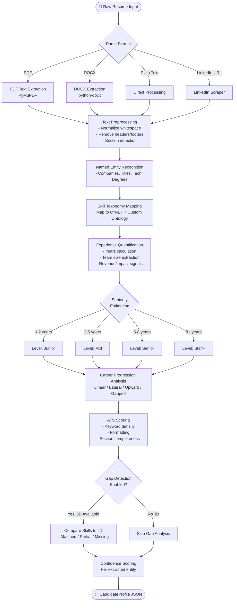

### 3.3 Input/Output Schema

```python
class ResumeAnalyzerInput(TypedDict):
    raw_resume_text: str
    target_role: Optional[str]
    jd_requirements: Optional[JDRequirements]  # for gap detection
    extraction_depth: str  # "basic" | "standard" | "deep"

class ResumeAnalyzerOutput(TypedDict):
    candidate_profile: CandidateProfile
    extraction_confidence: float
    processing_time_ms: int
    warnings: List[str]  # e.g., "Date gaps detected", "Ambiguous job title"
```

### 3.4 Skill Taxonomy Mapping

The Resume Analyzer maps extracted skills to a three-tier ontology:

**Tier 1: O*NET Occupational Categories**
- Technical skills mapped to O*NET Technology Skills taxonomy
- Soft skills mapped to O*NET Work Activities and Work Styles taxonomies

**Tier 2: Custom Tech Skill Ontology (2,400 entries)**
```python
SKILL_ONTOLOGY = {
    "programming_languages": {
        "python": {
            "aliases": ["Python 3", "py", "Python3"],
            "related": ["pandas", "numpy", "django", "fastapi", "flask"],
            "seniority_signal": "mid_to_senior"
        },
        "javascript": {
            "aliases": ["JS", "ES6", "ECMAScript", "Node"],
            "related": ["react", "vue", "angular", "nodejs"],
            "seniority_signal": "all_levels"
        },
        # ... 50+ languages
    },
    "frameworks": {
        # ... 200+ frameworks
    },
    "cloud_platforms": {
        "aws": {
            "services": ["EC2", "S3", "Lambda", "RDS", "DynamoDB", "EKS"],
            "certifications": ["AWS SAA", "AWS SAP", "AWS DVA"]
        },
        # ...
    },
    "databases": {
        # ... 40+ databases
    },
    # ... 15+ categories
}
```

**Tier 3: Role-Specific Skill Clusters**
- Frontend: React, CSS, Web performance, accessibility, browser APIs
- Backend: Databases, API design, authentication, caching, message queues
- DevOps: CI/CD, containers, IaC, monitoring, cloud platforms
- AI/ML: Frameworks (PyTorch, TensorFlow), MLOps, model serving, feature engineering

### 3.5 Experience Quantification Algorithm

```python
def quantify_experience(work_entry: WorkExperience) -> Dict[str, Any]:
    """
    Extracts quantifiable signals from raw work description text.
    """
    quantifiers = {
        "scale_indicators": [],
        "impact_metrics": [],
        "team_size": None,
        "revenue_impact": None,
        "performance_improvement": None
    }
    
    # Pattern matching for numerical signals
    SCALE_PATTERNS = [
        r"(\d+)\+?\s*(?:engineers|developers|team members|employees)",
        r"(?:led|managed|mentored)\s+(?:a\s+team\s+of\s+)?(\d+)",
        r"(\d+(?:\.\d+)?)\s*(?:million|billion|M|B)\s*(?:users|requests|records)",
        r"(\d+)%\s*(?:improvement|reduction|increase|decrease)",
        r"\$(\d+(?:\.\d+)?)\s*(?:million|billion|M|B)",
    ]
    
    for pattern in SCALE_PATTERNS:
        matches = re.findall(pattern, work_entry.description, re.IGNORECASE)
        if matches:
            quantifiers["scale_indicators"].extend(matches)
    
    # Determine impact level
    if any(indicator for indicator in ["billion", "10M+", "$100M"]):
        quantifiers["impact_level"] = "exceptional"
    elif any(indicator for indicator in ["million", "1M+", "$10M"]):
        quantifiers["impact_level"] = "high"
    else:
        quantifiers["impact_level"] = "medium"
    
    return quantifiers
```

### 3.6 ATS Scoring Engine

```python
ATS_SCORING_WEIGHTS = {
    "keyword_density": 0.25,       # Target keywords from JD present
    "section_completeness": 0.20,  # All standard sections present
    "date_consistency": 0.15,      # No date gaps, consistent format
    "formatting_quality": 0.15,    # No tables, columns, special chars
    "action_verb_usage": 0.10,     # Strong action verbs in bullets
    "quantification_rate": 0.10,   # % of bullets with metrics
    "contact_info": 0.05,          # Email, phone, LinkedIn present
}

def compute_ats_score(profile: CandidateProfile, jd: Optional[JDRequirements]) -> float:
    scores = {}
    
    scores["keyword_density"] = _compute_keyword_density(profile, jd)
    scores["section_completeness"] = _compute_section_completeness(profile)
    scores["date_consistency"] = _compute_date_consistency(profile)
    scores["formatting_quality"] = _compute_formatting_quality(profile)
    scores["action_verb_usage"] = _compute_action_verb_usage(profile)
    scores["quantification_rate"] = _compute_quantification_rate(profile)
    scores["contact_info"] = _compute_contact_completeness(profile)
    
    weighted_score = sum(
        scores[k] * ATS_SCORING_WEIGHTS[k] 
        for k in ATS_SCORING_WEIGHTS
    )
    
    return round(weighted_score * 100, 1)  # Return as 0-100 score
```

---

## 4. Agent 2: JD Analyzer

### 4.1 Agent Overview

The JD Analyzer transforms raw job description text into structured requirement profiles, enabling downstream agents to personalize questions and match candidate skills precisely.

### 4.2 Decision Tree

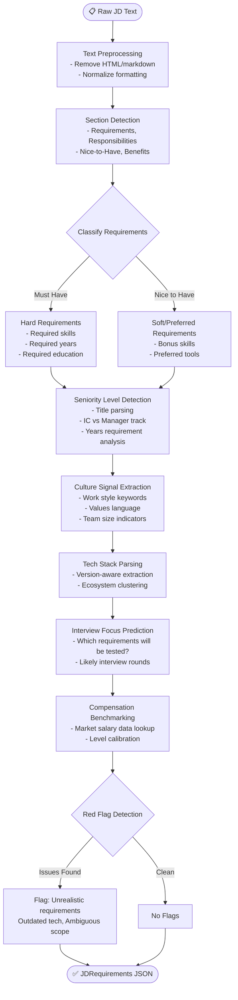

### 4.3 Seniority Detection Algorithm

```python
SENIORITY_KEYWORDS = {
    "intern": ["intern", "internship", "co-op"],
    "junior": ["junior", "entry level", "entry-level", "graduate", "new grad", "0-2 years"],
    "mid": ["mid", "mid-level", "2-5 years", "3+ years", "4+ years"],
    "senior": ["senior", "sr.", "5+ years", "6+ years", "7+ years", "experienced"],
    "staff": ["staff", "principal", "8+ years", "10+ years", "lead"],
    "manager": ["manager", "engineering manager", "em ", "lead ", "team lead"],
    "director": ["director", "head of", "vp of", "vp engineering"],
}

def detect_seniority_level(jd_text: str, title: str) -> str:
    text_lower = (jd_text + " " + title).lower()
    
    # Score each level by keyword presence
    scores = {level: 0 for level in SENIORITY_KEYWORDS}
    for level, keywords in SENIORITY_KEYWORDS.items():
        for kw in keywords:
            if kw in text_lower:
                scores[level] += 1
    
    # Additional signal: years of experience requirement
    years_match = re.search(r"(\d+)\+?\s*years?\s+(?:of\s+)?experience", text_lower)
    if years_match:
        years = int(years_match.group(1))
        if years >= 8: scores["staff"] += 3
        elif years >= 5: scores["senior"] += 3
        elif years >= 2: scores["mid"] += 3
        else: scores["junior"] += 3
    
    return max(scores, key=scores.get)
```

### 4.4 Culture Signal Extraction

```python
CULTURE_SIGNAL_TAXONOMY = {
    "fast_paced": ["fast-paced", "high-growth", "startup", "agile", "dynamic", "rapid"],
    "collaborative": ["team player", "cross-functional", "collaborative", "pair programming"],
    "autonomous": ["self-starter", "independent", "ownership", "take initiative", "autonomous"],
    "data_driven": ["data-driven", "metrics", "analytical", "experiment", "A/B test"],
    "customer_focused": ["customer obsession", "user-centric", "customer-first", "user feedback"],
    "innovation_focused": ["innovative", "cutting-edge", "research", "experimentation", "creative"],
    "process_oriented": ["process improvement", "documentation", "structured", "compliance"],
    "remote_friendly": ["remote", "distributed", "async", "work from anywhere", "flexible"],
}
```

---

## 5. Agent 3: Question Generator

### 5.1 Agent Overview

The Question Generator creates a personalized, calibrated question bank for each interview session, ensuring questions are relevant to the candidate's experience, target role, interview type, and desired difficulty level.

### 5.2 Decision Tree

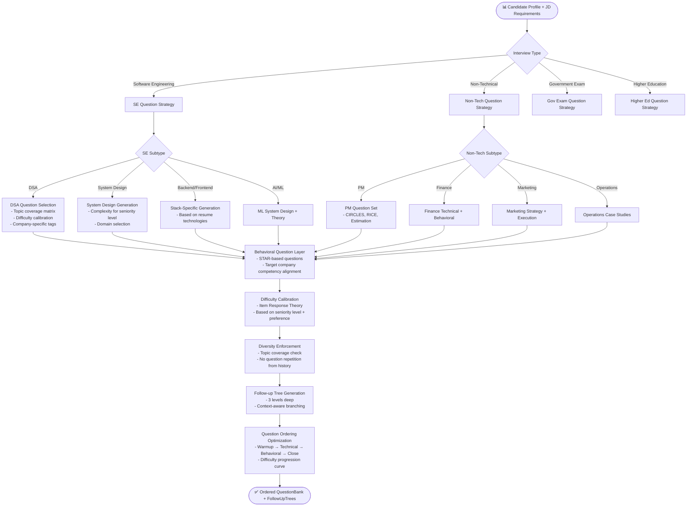

### 5.3 Bloom's Taxonomy Alignment

Every generated question is tagged with a Bloom's Taxonomy level to ensure cognitive diversity:

| Level | % of Questions | Example Question Type |
|---|---|---|
| Remember | 5% | "What is the time complexity of binary search?" |
| Understand | 15% | "Explain the difference between TCP and UDP" |
| Apply | 30% | "Implement an LRU cache in Python" |
| Analyze | 25% | "Why would you choose PostgreSQL over MongoDB for this use case?" |
| Evaluate | 15% | "Critique this system design — what are its weaknesses?" |
| Create | 10% | "Design a real-time notification system for 50M users" |

### 5.4 Adaptive Difficulty with IRT

```python
class ItemResponseTheory:
    """
    Uses the 3-Parameter Logistic (3PL) IRT model to select 
    optimally calibrated questions for each candidate.
    """
    
    def compute_probability(self, theta: float, a: float, b: float, c: float) -> float:
        """
        P(θ) = c + (1-c) * 1 / (1 + exp(-a*(θ - b)))
        
        θ: candidate ability estimate (-3 to +3)
        a: discrimination parameter
        b: difficulty parameter (-3 to +3)
        c: guessing parameter
        """
        import math
        return c + (1 - c) / (1 + math.exp(-a * (theta - b)))
    
    def select_next_question(
        self, 
        candidate_theta: float, 
        available_questions: List[Question],
        asked_topics: Set[str]
    ) -> Question:
        """
        Selects the next question that maximizes Fisher Information
        for the current ability estimate while respecting topic diversity.
        """
        max_info = -1
        best_question = None
        
        for q in available_questions:
            # Skip if topic already covered
            if q.topic in asked_topics:
                continue
            
            # Compute Fisher Information at current theta
            p = self.compute_probability(candidate_theta, q.a_param, q.b_param, q.c_param)
            info = (q.a_param ** 2) * ((p - q.c_param) ** 2) / ((1 - q.c_param) ** 2 * p * (1 - p))
            
            if info > max_info:
                max_info = info
                best_question = q
        
        return best_question
    
    def update_theta(
        self, 
        current_theta: float, 
        question: Question, 
        correct: bool
    ) -> float:
        """
        Updates ability estimate using Maximum Likelihood Estimation.
        """
        # Simplified Newton-Raphson update
        step_size = 0.3 if correct else -0.3
        difficulty_adjustment = question.b_param - current_theta
        return current_theta + step_size * (1 / (1 + abs(difficulty_adjustment)))
```

### 5.5 Question Diversity Constraints

```python
QUESTION_DIVERSITY_RULES = {
    "software_engineering": {
        "min_topic_coverage": 0.6,  # Must cover 60% of defined topic areas
        "max_same_topic": 2,         # No more than 2 questions from same topic
        "behavioral_ratio": 0.25,    # 25% of questions must be behavioral
        "system_design_ratio": 0.15, # 15% system design (for senior+ levels)
        "coding_ratio": 0.40,        # 40% coding/DSA problems
    },
    "non_technical": {
        "framework_coverage": ["STAR", "CIRCLES", "estimation"],
        "behavioral_ratio": 0.50,    # 50% behavioral for non-tech roles
        "domain_specific_ratio": 0.35,
        "situational_ratio": 0.15,
    }
}
```

---

## 6. Agent 4: Interview Conductor

### 6.1 Agent Overview

The Interview Conductor is the **real-time conversational agent** that manages the live interview experience — asking questions, processing responses, generating follow-ups, and maintaining the conversational flow of a realistic interview.

### 6.2 Decision Tree

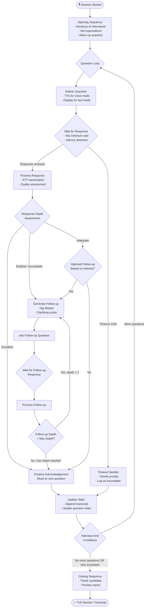

### 6.3 Voice Pipeline Integration

```python
class VoiceInterviewPipeline:
    """
    Manages the real-time voice pipeline for live interview sessions.
    """
    
    def __init__(self):
        self.stt_client = DeepgramClient(api_key=settings.DEEPGRAM_API_KEY)
        self.tts_client = ElevenLabsClient(api_key=settings.ELEVENLABS_API_KEY)
        self.audio_buffer = asyncio.Queue()
        
    async def stream_question_to_candidate(
        self, 
        question_text: str, 
        interviewer_persona: str = "formal"
    ) -> None:
        """
        Converts question to speech and streams to candidate in chunks.
        Target: First chunk delivered within 200ms.
        """
        voice_id = PERSONA_VOICE_MAP[interviewer_persona]
        
        async for chunk in self.tts_client.stream(
            text=question_text,
            voice_id=voice_id,
            model_id="eleven_turbo_v2",  # Lowest latency model
            stream=True
        ):
            await self.audio_buffer.put(chunk)
    
    async def transcribe_candidate_response(
        self,
        audio_stream: AsyncIterator[bytes]
    ) -> AsyncIterator[str]:
        """
        Real-time transcription of candidate audio.
        Returns partial transcripts as candidate speaks.
        """
        options = LiveOptions(
            model="nova-2",
            language="en-IN",  # Optimized for Indian English accent
            punctuate=True,
            interim_results=True,
            endpointing=500,  # 500ms silence = end of utterance
        )
        
        async with self.stt_client.listen.asynclive(options) as connection:
            async for chunk in audio_stream:
                await connection.send(chunk)
            
            async for result in connection:
                if result.channel.alternatives[0].transcript:
                    yield result.channel.alternatives[0].transcript
    
    async def detect_filler_words(self, transcript: str) -> Dict[str, int]:
        """
        Counts filler words in the candidate's response.
        """
        FILLER_WORDS = [
            "um", "uh", "like", "you know", "basically", "literally",
            "actually", "kind of", "sort of", "right", "so"
        ]
        counts = {}
        transcript_lower = transcript.lower()
        for filler in FILLER_WORDS:
            count = len(re.findall(r'\b' + re.escape(filler) + r'\b', transcript_lower))
            if count > 0:
                counts[filler] = count
        return counts
```

### 6.4 Dynamic Follow-up Generation

```python
FOLLOW_UP_TEMPLATES = {
    "shallow_response": [
        "Could you elaborate on {specific_element} you mentioned?",
        "Walk me through your exact reasoning for that approach.",
        "What challenges did you encounter, and how did you overcome them?",
    ],
    "technical_probe": [
        "What's the time complexity of that approach?",
        "How would this scale to 100x the current load?",
        "What are the failure modes of this design?",
        "Have you considered an alternative approach using {technology}?",
    ],
    "behavioral_probe": [
        "What was the most difficult part of that situation?",
        "What would you do differently if you faced this again?",
        "What was the quantifiable outcome of your actions?",
    ],
    "cross_reference": [
        "Earlier you mentioned {earlier_context}. How does that relate to what you just described?",
        "This sounds similar to {previous_situation} you described. What's different here?",
    ]
}
```

---

## 7. Agent 5: Communication Evaluator

### 7.1 Agent Overview

The Communication Evaluator performs deep linguistic and paralinguistic analysis of candidate responses, scoring eight sub-dimensions of communication quality.

### 7.2 Decision Tree

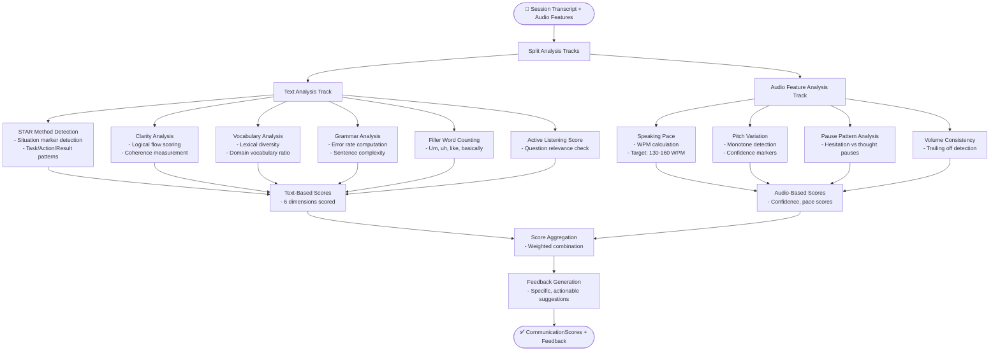

### 7.3 STAR Method Detection Algorithm

```python
class STARDetector:
    """
    Detects STAR method compliance in behavioral interview responses.
    Uses semantic similarity + pattern matching for robust detection.
    """
    
    SITUATION_MARKERS = [
        "at the time", "when i was", "we were working on", "the project",
        "the situation was", "we faced", "our team was", "the company was",
        "last year", "during", "in my previous", "while working at"
    ]
    
    TASK_MARKERS = [
        "my responsibility was", "i was asked to", "my goal was", "i needed to",
        "the task was", "i was assigned", "my role was", "we had to"
    ]
    
    ACTION_MARKERS = [
        "i decided to", "i implemented", "i created", "i built", "i led",
        "i reached out", "i proposed", "i coordinated", "i analyzed",
        "what i did was", "my approach was", "i took the initiative"
    ]
    
    RESULT_MARKERS = [
        "as a result", "the outcome was", "this led to", "we achieved",
        "we reduced", "we increased", "the impact was", "ultimately",
        "in the end", "this resulted in", "we saved", "we improved"
    ]
    
    def analyze_star_compliance(self, response: str) -> Dict[str, Any]:
        response_lower = response.lower()
        
        components = {
            "situation": self._detect_component(response_lower, self.SITUATION_MARKERS),
            "task": self._detect_component(response_lower, self.TASK_MARKERS),
            "action": self._detect_component(response_lower, self.ACTION_MARKERS),
            "result": self._detect_component(response_lower, self.RESULT_MARKERS),
        }
        
        components_present = sum(1 for v in components.values() if v["detected"])
        compliance_score = components_present / 4.0
        
        return {
            "compliance_score": compliance_score,
            "components_present": components_present,
            "component_detail": components,
            "missing_components": [k for k, v in components.items() if not v["detected"]],
            "score": round(compliance_score * 10, 1)
        }
```

### 7.4 Vocabulary Richness Scoring

```python
def compute_vocabulary_richness(text: str) -> Dict[str, float]:
    """
    Computes multiple vocabulary richness metrics.
    """
    words = nltk.word_tokenize(text.lower())
    content_words = [w for w in words if w.isalpha() and w not in STOPWORDS]
    
    metrics = {
        # Type-Token Ratio: Unique words / Total words
        "ttr": len(set(content_words)) / max(len(content_words), 1),
        
        # Moving Average TTR (more stable for varying text lengths)
        "mattr": compute_mattr(content_words, window=50),
        
        # Measure of Textual Lexical Diversity
        "mtld": compute_mtld(content_words),
        
        # Domain vocabulary ratio: tech terms / total content words
        "domain_vocabulary_ratio": compute_domain_ratio(content_words),
        
        # Average word length (proxy for sophistication)
        "avg_word_length": sum(len(w) for w in content_words) / max(len(content_words), 1),
    }
    
    # Normalize to 0-10 score
    vocab_score = (
        0.3 * normalize(metrics["ttr"], 0.3, 0.7) +
        0.3 * normalize(metrics["mattr"], 0.5, 0.85) +
        0.2 * normalize(metrics["domain_vocabulary_ratio"], 0.05, 0.25) +
        0.2 * normalize(metrics["avg_word_length"], 4.0, 7.0)
    ) * 10
    
    return {**metrics, "vocab_score": round(vocab_score, 1)}
```

---

## 8. Agent 6: Technical Evaluator

### 8.1 Agent Overview

The Technical Evaluator assesses the depth and accuracy of responses to technical questions, covering code quality, problem-solving approach, system design thinking, and domain knowledge.

### 8.2 Decision Tree

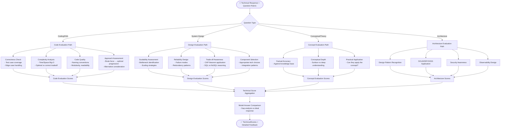

### 8.3 Code Quality Metrics

```python
class CodeQualityAnalyzer:
    """
    Analyzes submitted code solutions for quality metrics beyond correctness.
    """
    
    def analyze(self, code: str, language: str) -> Dict[str, Any]:
        metrics = {}
        
        # 1. Naming Convention Score
        metrics["naming_quality"] = self._analyze_naming(code, language)
        
        # 2. Function Length (prefer < 30 lines per function)
        metrics["function_length_score"] = self._analyze_function_lengths(code)
        
        # 3. Comments and Documentation
        metrics["documentation_ratio"] = self._compute_comment_ratio(code)
        
        # 4. Cyclomatic Complexity
        metrics["cyclomatic_complexity"] = self._compute_cyclomatic_complexity(code)
        
        # 5. DRY Principle (code duplication detection)
        metrics["dry_score"] = self._detect_code_duplication(code)
        
        # 6. Error Handling Presence
        metrics["error_handling"] = self._detect_error_handling(code, language)
        
        # 7. Edge Case Coverage
        metrics["edge_case_mentions"] = self._detect_edge_case_mentions(code)
        
        # Weighted quality score
        quality_score = (
            0.20 * metrics["naming_quality"] +
            0.15 * metrics["function_length_score"] +
            0.10 * metrics["documentation_ratio"] +
            0.20 * (10 - min(metrics["cyclomatic_complexity"], 10)) +
            0.15 * metrics["dry_score"] +
            0.10 * metrics["error_handling"] +
            0.10 * metrics["edge_case_mentions"]
        )
        
        return {**metrics, "overall_quality_score": round(quality_score, 1)}
```

---

## 9. Agent 7: Behavioral Evaluator

### 9.1 Agent Overview

The Behavioral Evaluator analyzes behavioral interview responses against a comprehensive competency framework, assessing leadership, teamwork, conflict resolution, growth mindset, and cultural alignment.

### 9.2 Decision Tree

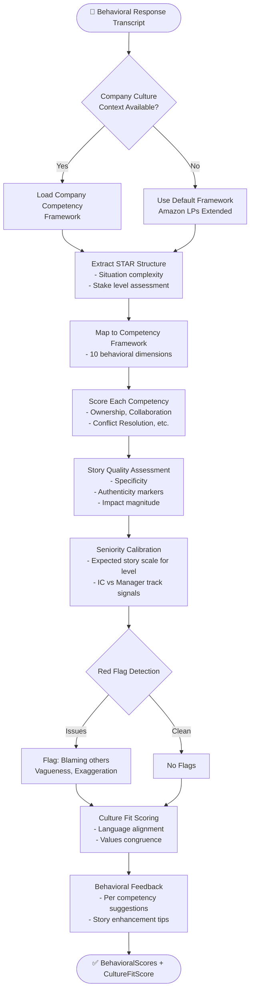

### 9.3 Competency Framework Definitions

```python
BEHAVIORAL_COMPETENCIES = {
    "ownership_accountability": {
        "description": "Takes full responsibility for outcomes; doesn't blame others or external factors",
        "positive_signals": [
            "I took responsibility for", "I owned the outcome", "I was accountable for",
            "I should have", "I realized I needed to change", "I initiated"
        ],
        "negative_signals": [
            "it wasn't my fault", "they didn't", "if only the team had",
            "management failed to", "circumstances prevented"
        ],
        "weight_by_level": {"junior": 0.8, "mid": 1.0, "senior": 1.2, "staff": 1.4}
    },
    "collaboration_teamwork": {
        "description": "Works effectively across team boundaries; builds consensus; uplifts others",
        "positive_signals": [
            "we aligned on", "I helped the team", "I facilitated", "I brought together",
            "together we", "I collaborated with", "I sought input from"
        ],
        "negative_signals": [
            "I did it alone", "I had to do everything myself", "no one else would"
        ],
        "weight_by_level": {"junior": 1.0, "mid": 1.0, "senior": 1.1, "staff": 1.3}
    },
    "conflict_resolution": {
        "description": "Navigates disagreements constructively; finds common ground; de-escalates",
        "positive_signals": [
            "I listened to their perspective", "I found common ground", "we compromised on",
            "I acknowledged their concern", "I reframed the issue"
        ],
        "negative_signals": [
            "I escalated immediately", "I ignored their input", "I went around them"
        ],
        "weight_by_level": {"junior": 0.9, "mid": 1.0, "senior": 1.2, "staff": 1.4}
    },
    # ... 7 more competencies
}
```

---

## 10. Agent 8: Learning Coach

### 10.1 Agent Overview

The Learning Coach is the post-interview intelligence layer that synthesizes all evaluation scores into a personalized, actionable 90-day improvement plan.

### 10.2 Decision Tree

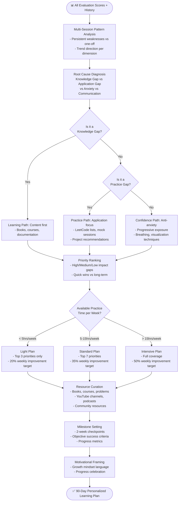

### 10.3 Resource Recommendation Engine

```python
RESOURCE_CATALOG = {
    "dsa": {
        "beginner": {
            "books": ["Grokking Algorithms - Bhargava", "Data Structures & Algorithms in Python - Goodrich"],
            "courses": ["CS50x (Harvard)", "Data Structures Coursera (UCSD)"],
            "platforms": ["LeetCode Easy Patterns", "NeetCode.io - Beginner Path"],
            "youtube": ["NeetCode", "Back To Back SWE", "CS Dojo"],
        },
        "intermediate": {
            "books": ["Elements of Programming Interviews - Aziz", "Cracking the Coding Interview - McDowell"],
            "courses": ["AlgoExpert (Clement Mihailescu)", "LeetCode Premium"],
            "platforms": ["LeetCode Medium - Pattern Focused", "HackerRank Intermediate"],
            "youtube": ["TechLead", "Errichto", "William Fiset"],
        },
        "advanced": {
            "books": ["Competitive Programming 3 - Halim", "The Algorithm Design Manual - Skiena"],
            "courses": ["Codeforces Div 1 Practice", "AtCoder Graduate Contests"],
            "platforms": ["LeetCode Hard - Company Specific", "Codeforces 1800+"],
            "youtube": ["Colin Galen", "Errichto Advanced"],
        }
    },
    "system_design": {
        "all_levels": {
            "books": ["Designing Data-Intensive Applications - Kleppmann", "System Design Interview - Xu"],
            "courses": ["Grokking System Design (Educative)", "System Design Primer (GitHub)"],
            "platforms": ["Excalidraw practice", "Lucidchart templates"],
            "youtube": ["Gaurav Sen", "Tech Dummies", "ByteByteGo"],
        }
    },
    "behavioral": {
        "all_levels": {
            "books": ["Cracking PM Interview", "The STAR Method (Amazon specific guides)"],
            "resources": ["LinkedIn Learning - Behavioral Interviews", "TED Talks on Leadership"],
            "practice": ["Mock interviews with peers", "Journaling STAR stories"],
        }
    }
    # ... comprehensive catalog for all domains
}
```

---

## 11. Agent 9: Progress Tracker

### 11.1 Agent Overview

The Progress Tracker maintains the longitudinal intelligence layer of InterviewOS, analyzing performance trends over time and providing objective evidence of improvement.

### 11.2 Decision Tree

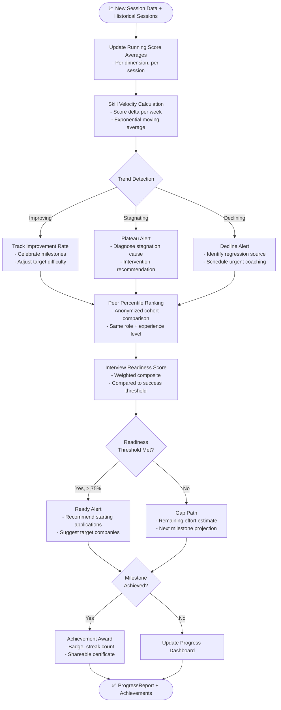

### 11.3 Skill Velocity Algorithm

```python
def compute_skill_velocity(
    dimension_scores: List[Dict[str, float]],  # [{date, score}, ...] per dimension
    dimension_name: str,
    smoothing_alpha: float = 0.3  # EMA smoothing factor
) -> Dict[str, float]:
    """
    Computes skill improvement velocity using Exponential Moving Average.
    
    Returns:
        - velocity: points per week (positive = improving)
        - acceleration: change in velocity (positive = accelerating)
        - trend: "improving" | "stagnating" | "declining"
        - eta_to_target: estimated weeks to reach target score
    """
    if len(dimension_scores) < 2:
        return {"velocity": 0.0, "trend": "insufficient_data"}
    
    # Sort by date
    sorted_scores = sorted(dimension_scores, key=lambda x: x["date"])
    
    # Compute EMA
    ema_scores = [sorted_scores[0]["score"]]
    for i in range(1, len(sorted_scores)):
        ema = smoothing_alpha * sorted_scores[i]["score"] + (1 - smoothing_alpha) * ema_scores[-1]
        ema_scores.append(ema)
    
    # Compute velocity (score change per week)
    recent_scores = ema_scores[-4:]  # Last 4 sessions
    if len(recent_scores) >= 2:
        weeks_elapsed = _compute_weeks_elapsed(sorted_scores[-4:])
        velocity = (recent_scores[-1] - recent_scores[0]) / max(weeks_elapsed, 0.1)
    else:
        velocity = 0.0
    
    # Determine trend
    VELOCITY_THRESHOLDS = {"improving": 0.2, "stagnating": -0.1}
    if velocity > VELOCITY_THRESHOLDS["improving"]:
        trend = "improving"
    elif velocity < VELOCITY_THRESHOLDS["stagnating"]:
        trend = "declining"
    else:
        trend = "stagnating"
    
    # ETA to target score (typically 8.0/10)
    current_score = ema_scores[-1]
    target_score = 8.0
    if velocity > 0 and current_score < target_score:
        eta_weeks = (target_score - current_score) / velocity
    else:
        eta_weeks = None
    
    return {
        "current_ema_score": round(current_score, 2),
        "velocity": round(velocity, 3),
        "trend": trend,
        "eta_to_target_weeks": round(eta_weeks, 1) if eta_weeks else None,
        "data_points": len(sorted_scores)
    }
```

---

## 12. Inter-Agent Communication Protocols

### 12.1 Message Format

All inter-agent messages use a standardized envelope format:

```python
@dataclass
class AgentMessage:
    message_id: str           # UUID
    sender_agent: str         # "resume_analyzer" | "jd_analyzer" | ...
    recipient_agent: str      # Target agent name or "orchestrator"
    session_id: str           # Interview session identifier
    message_type: str         # "result" | "error" | "status" | "request"
    payload: Dict[str, Any]   # Agent-specific data payload
    correlation_id: str       # Links related messages
    timestamp: str            # ISO 8601
    version: str              # Message schema version "1.0"
    metadata: Dict[str, Any]  # Latency, token count, model used, etc.
```

### 12.2 Event Bus Design

```python
class InterviewOSEventBus:
    """
    Pub/Sub event bus using Google Cloud Pub/Sub for async agent communication.
    """
    
    TOPICS = {
        "pre_interview_complete": "projects/{}/topics/pre-interview-complete",
        "question_bank_ready": "projects/{}/topics/question-bank-ready",
        "session_transcript_ready": "projects/{}/topics/session-transcript-ready",
        "evaluation_complete": "projects/{}/topics/evaluation-complete",
    }
    
    async def publish(self, topic: str, message: AgentMessage) -> str:
        """Publishes a message and returns the message ID."""
        client = pubsub_v1.PublisherClient()
        topic_path = self.TOPICS[topic].format(settings.GCP_PROJECT_ID)
        data = json.dumps(asdict(message)).encode("utf-8")
        future = client.publish(topic_path, data)
        return future.result()
    
    async def subscribe(self, subscription: str, callback: Callable) -> None:
        """Subscribes to a topic and processes messages with callback."""
        client = pubsub_v1.SubscriberClient()
        subscription_path = f"projects/{settings.GCP_PROJECT_ID}/subscriptions/{subscription}"
        
        def _callback(message: pubsub_v1.types.ReceivedMessage) -> None:
            agent_message = AgentMessage(**json.loads(message.data.decode("utf-8")))
            callback(agent_message)
            message.ack()
        
        client.subscribe(subscription_path, callback=_callback)
```

---

## 13. State Management

### 13.1 LangGraph Checkpointing

```python
from langgraph.checkpoint.postgres import PostgresSaver
import psycopg

# Production checkpointing with PostgreSQL
with psycopg.connect(settings.DATABASE_URL) as conn:
    checkpointer = PostgresSaver(conn)
    checkpointer.setup()

graph = build_interview_graph().compile(
    checkpointer=checkpointer,
    interrupt_before=["interview_conductor"],  # Pause before live interview
)

# Save checkpoint at each turn
config = {"configurable": {"thread_id": session_id}}
for state_update in graph.stream(initial_state, config):
    logger.info(f"State updated: {state_update}")
```

### 13.2 Redis Session Cache

```python
class SessionStateCache:
    """
    Fast in-memory cache for active interview session state.
    Reduces database reads during live interview (< 5ms reads vs 50ms DB).
    """
    
    def __init__(self, redis_client: Redis):
        self.redis = redis_client
        self.TTL = 7200  # 2 hours (max session duration)
    
    async def save_session_state(self, session_id: str, state: InterviewOSState) -> None:
        key = f"session:{session_id}:state"
        await self.redis.setex(
            key, 
            self.TTL, 
            json.dumps(self._serialize_state(state))
        )
    
    async def get_session_state(self, session_id: str) -> Optional[InterviewOSState]:
        key = f"session:{session_id}:state"
        data = await self.redis.get(key)
        if data:
            return self._deserialize_state(json.loads(data))
        return None
    
    async def extend_session_ttl(self, session_id: str) -> None:
        """Called every 10 minutes of active session to prevent expiry."""
        key = f"session:{session_id}:state"
        await self.redis.expire(key, self.TTL)
```

---

## 14. Error Handling & Fallback Mechanisms

### 14.1 Agent-Level Error Handling

```python
class AgentErrorHandler:
    """
    Standardized error handling for all agents with retry logic and graceful degradation.
    """
    
    MAX_RETRIES = 3
    RETRY_DELAYS = [1.0, 2.0, 4.0]  # Exponential backoff in seconds
    
    async def execute_with_retry(
        self,
        agent_fn: Callable,
        agent_name: str,
        state: InterviewOSState,
        fallback_fn: Optional[Callable] = None
    ) -> Any:
        last_error = None
        
        for attempt in range(self.MAX_RETRIES):
            try:
                result = await agent_fn(state)
                # Clear error state on success
                state["agent_errors"].pop(agent_name, None)
                state["retry_counts"].pop(agent_name, None)
                return result
                
            except LLMRateLimitError:
                # Switch to fallback LLM provider
                await self._switch_llm_provider(agent_name)
                await asyncio.sleep(self.RETRY_DELAYS[attempt])
                
            except LLMTimeoutError:
                last_error = "timeout"
                await asyncio.sleep(self.RETRY_DELAYS[attempt])
                
            except ContextLengthExceededError:
                # Summarize and retry with condensed context
                state = await self._summarize_context(state)
                
            except Exception as e:
                last_error = str(e)
                logger.error(f"Agent {agent_name} attempt {attempt+1} failed: {e}")
                await asyncio.sleep(self.RETRY_DELAYS[attempt])
        
        # All retries exhausted — activate fallback
        state["agent_errors"][agent_name] = last_error
        state["fallback_activated"][agent_name] = True
        state["retry_counts"][agent_name] = self.MAX_RETRIES
        
        if fallback_fn:
            logger.warning(f"Agent {agent_name} using fallback function")
            return await fallback_fn(state)
        
        return self._build_degraded_output(agent_name)
```

### 14.2 Fallback Strategies Per Agent

| Agent | Primary Failure | Fallback Strategy |
|---|---|---|
| Resume Analyzer | LLM timeout | Rule-based keyword extraction + regex NER |
| JD Analyzer | LLM timeout | Keyword list extraction; skip culture signals |
| Question Generator | LLM failure | Sample from pre-generated question bank by role/level |
| Interview Conductor | STT failure | Switch to text mode; LLM for follow-ups still active |
| Communication Evaluator | Model failure | Rule-based STAR detection + filler word count only |
| Technical Evaluator | LLM failure | Rubric-based scoring with keyword matching |
| Behavioral Evaluator | LLM failure | Competency keyword matching + STAR structure scoring |
| Learning Coach | LLM failure | Template-based plan with static resource lists |
| Progress Tracker | DB failure | Use cached session data; skip percentile ranking |

### 14.3 Circuit Breaker Pattern

```python
class AgentCircuitBreaker:
    """
    Implements the circuit breaker pattern to prevent cascade failures
    when an external service (LLM API, STT, TTS) is degraded.
    """
    
    def __init__(self, agent_name: str, failure_threshold: int = 5, recovery_timeout: int = 60):
        self.agent_name = agent_name
        self.failure_threshold = failure_threshold
        self.recovery_timeout = recovery_timeout
        self.failure_count = 0
        self.state = "closed"  # closed | open | half-open
        self.last_failure_time = None
    
    async def call(self, fn: Callable, *args, **kwargs) -> Any:
        if self.state == "open":
            if time.time() - self.last_failure_time > self.recovery_timeout:
                self.state = "half-open"
            else:
                raise CircuitOpenError(f"Circuit breaker open for agent: {self.agent_name}")
        
        try:
            result = await fn(*args, **kwargs)
            if self.state == "half-open":
                self.state = "closed"
                self.failure_count = 0
            return result
            
        except Exception as e:
            self.failure_count += 1
            self.last_failure_time = time.time()
            
            if self.failure_count >= self.failure_threshold:
                self.state = "open"
                logger.critical(f"Circuit breaker opened for {self.agent_name}")
                await _notify_ops_team(self.agent_name, str(e))
            
            raise
```

---

## 15. Observability

### 15.1 Structured Logging

```python
import structlog

logger = structlog.get_logger()

def log_agent_execution(agent_name: str, session_id: str, duration_ms: float, tokens_used: int):
    logger.info(
        "agent_execution_complete",
        agent_name=agent_name,
        session_id=session_id,
        duration_ms=duration_ms,
        tokens_used=tokens_used,
        timestamp=datetime.utcnow().isoformat(),
    )
```

### 15.2 Key Metrics

| Metric | Type | Labels |
|---|---|---|
| `agent_execution_duration_ms` | Histogram | agent_name, session_id |
| `agent_error_count` | Counter | agent_name, error_type |
| `agent_retry_count` | Counter | agent_name |
| `fallback_activation_count` | Counter | agent_name |
| `llm_token_usage` | Counter | agent_name, model, token_type |
| `stt_latency_ms` | Histogram | provider |
| `tts_latency_ms` | Histogram | provider |
| `session_completion_rate` | Gauge | interview_type |
| `report_generation_time_ms` | Histogram | |

### 15.3 Distributed Tracing

All agent executions are instrumented with OpenTelemetry for distributed tracing, enabling full request path visualization from user input to report delivery.

---

## 16. Security Architecture

### 16.1 Data Classification

| Data Type | Classification | Encryption | Retention |
|---|---|---|---|
| Resume text | PII | AES-256 at rest | Until account deletion |
| Session transcripts | PII | AES-256 at rest | 90 days (configurable) |
| Audio recordings | PII | AES-256 at rest | 30 days (with consent) |
| Performance scores | Internal | AES-256 at rest | Until account deletion |
| Question bank | Confidential | AES-256 at rest | Indefinite |
| API keys | Secret | HashiCorp Vault | Rotated quarterly |

### 16.2 Authentication & Authorization

```python
# JWT Token Structure
{
    "sub": "user_id",
    "email": "user@example.com",
    "role": "candidate",           # candidate | enterprise_admin | super_admin
    "plan": "pro",                 # free | pro | enterprise
    "session_id": "optional",      # Present during live interview
    "exp": 1720000000,
    "iat": 1719999100,
}

# Role-Based Access Control
RBAC_POLICIES = {
    "candidate": {
        "allow": ["read:own_sessions", "write:own_sessions", "read:question_bank"],
        "deny": ["read:other_sessions", "write:question_bank", "admin:*"],
    },
    "enterprise_admin": {
        "allow": ["read:cohort_sessions", "write:custom_questions", "admin:cohort"],
        "deny": ["read:individual_pii", "admin:system"],
    },
    "super_admin": {
        "allow": ["*"],
        "deny": [],
    }
}
```

---

## 17. Deployment Architecture

### 17.1 Container Design

Each agent is deployed as an independent microservice in Kubernetes:

```yaml
apiVersion: apps/v1
kind: Deployment
metadata:
  name: resume-analyzer
  namespace: interviewos
spec:
  replicas: 3
  selector:
    matchLabels:
      app: resume-analyzer
  template:
    metadata:
      labels:
        app: resume-analyzer
    spec:
      containers:
      - name: resume-analyzer
        image: gcr.io/interviewos/resume-analyzer:latest
        resources:
          requests:
            cpu: "500m"
            memory: "512Mi"
          limits:
            cpu: "2000m"
            memory: "2Gi"
        env:
        - name: LLM_API_KEY
          valueFrom:
            secretKeyRef:
              name: interviewos-secrets
              key: gemini-api-key
```

### 17.2 Scaling Strategy

| Service | Min Replicas | Max Replicas | Scale Trigger |
|---|---|---|---|
| API Gateway | 3 | 20 | CPU > 70% |
| Resume Analyzer | 2 | 10 | Queue depth > 10 |
| JD Analyzer | 2 | 10 | Queue depth > 10 |
| Question Generator | 2 | 15 | Queue depth > 5 |
| Interview Conductor | 5 | 50 | Active sessions > 80% capacity |
| Evaluators (×3) | 3 | 15 | Queue depth > 20 |
| Learning Coach | 2 | 10 | Queue depth > 30 |
| Progress Tracker | 2 | 8 | Queue depth > 50 |

---

*Document End — InterviewOS Agent Architecture v1.0.0*  
*For questions, contact: engineering@interviewos.ai*
